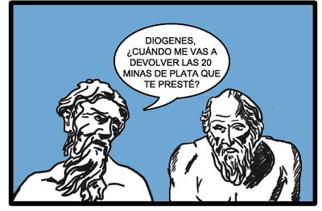
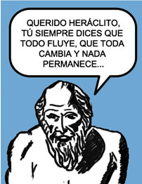
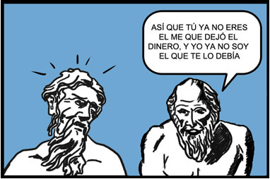

# FILOCOMIC

Os dejo el magnífico Filocómic que Daniel Tubau ha realizado en su página, a partir de un texto de Epicarmo:

Heráclito y su deudor

  

Si queréis ver el original, y no conformaros con sucedaneos, no dejeis de visitar su página [www.danieltubau.com](http://www.danieltubau.com)
