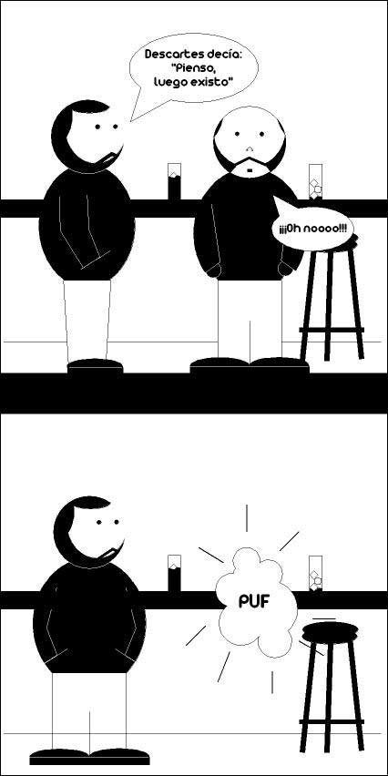

# Cómic

Siguiendo la estela dejada por [Daniel Tubau](http://www.danieltubau.com) y su filo-cómic, o sus viñetas filosíficas de “caja y mosca”, he decidido crear mis propias viñetas.

La primera esta dedicada a Descartes y espero que os guste:

Descartes
