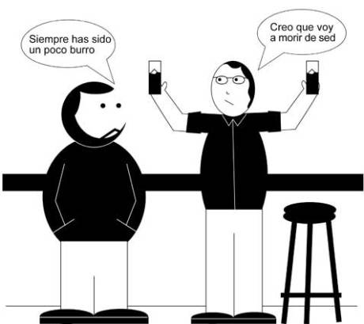

# Asno de Buridán

Buridan

Ya ha llegado la segunda entrega del cómic “Filosofía de Barra”, esta vez dedicada a la paradójica historia del [“Asno de Buridán”,](http://es.wikipedia.org/wiki/Asno_de_Burid%C3%A1n) que nos introduce en la vieja discusión filosófica sobre el libre albedrío.
