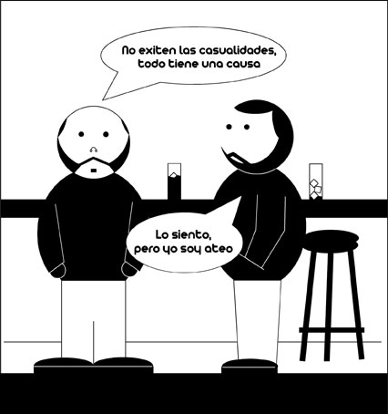

# Causalidad

Aqui dejo una nueva entrega de “Filosofía de Barra” esta vez dedicada a la idea de causalidad. En una próxima entrada desarrollaré lo que este concepto supone, y aclararé la viñeta por si alguien no la entiende.
