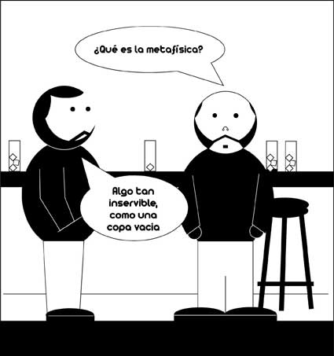

# Cómic sobre Neopositivismo

Rudolf Carnap fue el  representante más destacado del Círculo de Viena y, por tanto, del neopositivismo lógico. Dicho movimiento se caracterizó por la crítica  a la metafísica por ser inservible.
