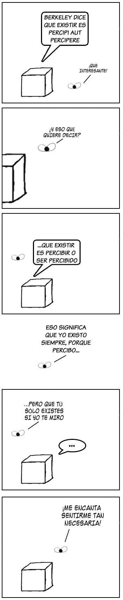

# Caja y mosca

Hoy os dejo un interesante cómic filosófico de [Daniel Tuabu](http://danieltubau.com/weblog/weblog_44_inventariodigital.html "Daniel Tubau"):

La serie de Caja y mosca fue la serie que me inspiró para crear mi serie Filosofía de barra. La podeis seguir en [Caja y mosca](http://www.danieltubau.com/comic/moscaycaja_danieltubau.html).
