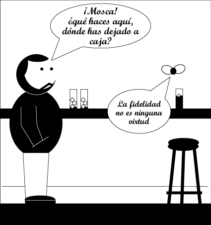

# Elogio a la infidelidad

[*Elogio a la infidelidad*](http://danieltubau.com/wordpress/?p=1811) es el último libro de [Daniel Tubau](http://danieltubau.com/ "Blog de Daniel Tubau"), el cual se queja de nunca saco en mis viñetas. Así, que hoy, le sacaré de la manera que él memos espera, desde su *alter ego* Mosca:

También puedes seguir las aventuras de [Caja y Mosca](http://danieltubau.com/wordpress/?p=2834 "Caja y Mosca") y todas las cosas interesantes de las que habla Daniel en su laberíntico blog.
