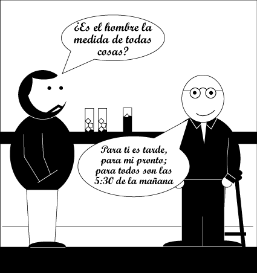

# Relativismo

El relativismo de Protágoras

Protágoras fue el célebre autor de la frase “El hombre es la medida de todas las cosas”. A partir de dicha frase, que muchos creen cierta, defienden un conocimiento irracional de las cosas, en la que no hay certezas absolutas (solamente individuales), y en el que por lo tanto no tiene cabida la ciencia; sólo nos podemos regir por la fe y las creencias.
