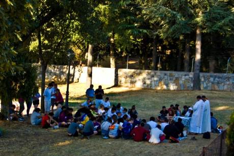

# I love Papa

Desde la ventana de mi casa descubro medio centenar de jóvenes que se acercan a las 8:30 de la mañana, se posicionan en los jardines situados detrás de mi casa… desde la cocina los observo mientras tomo mi vaso de leche. Traen una mesa ¿que harán? Bueno simplemente se colocan en corro, uno de ellos se viste con una túnica blanca y empiezan a celebrar una misa. Es de suponer que a los devotos de JMJ, esto lo harán con sumo agrado; aunque a mi, realmente, me han agriado un poco el desayuno.

Me fijo bien, una chica lleva una camiseta de I love NY. No sé muy bien por qué, pero me parece un tanto extraño ver como la devoción va acompañada de elementos y logotipos, más próximos de lo material que de lo espiritual. Este pensamiento hace que mi mente divague y empiece a pensar en el “merchandaising” que acompaña a la visita del Papa a España; banderitas, camisetas, gorras, carteles, etc… me da la sensación de un superestreno de Disney, más que la visita de un líder espiritual.

Esta claro que todo es bueno para conseguir fieles, no olvidemos que hace unos siglos, la fe y la conversión se lograba gracias a golpe de espada. Ahora las armas tienen que ser otras, el marketing y la mercadotecnia, se apodera de la iglesia para conseguir fieles. Pero ¿hasta que punto es esto legítimo?

Se supone, que ser católico y creer en Dios es un acto de fe, pero viendo a estos jóvenes me planteo si realmente vienen a ver, a recibir y a escuchar a su guía, o simplemente a pasar unos días de vacaciones, y volverse a su lugar de origen con un autógrafo de su ídolo (como si de Justin Bieber se tratara). Desde luego, esto no es lo que me quisieron inculcar, en mi infancia (8 años en un colegio de curas), así que pienso que esto esta más lejos de un verdadero pensamiento religioso (católico), de lo que sus organizadores nos quieren hacer creer; y que realmente es el materialismo y no la fe, la que mueve montañas.
