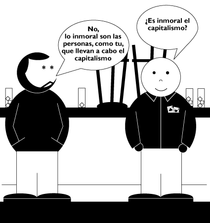

# ¿Es moral el capitalismo?

Ante la pregunta de si es moral o inmoral el capitalismo, la respuesta evidente es no. La moralidad es una categoria propia de las personas, del ser humano en general, no de los conceptos, ni de las cosas, ni de los animales… Pero si las personas que llevan a cabo las acciones y hacen que otras (acciones) sean posibles, como el capitalismo. Es decir, el capitalismo no es inmoral, lo inmoral son los capitalistas.
