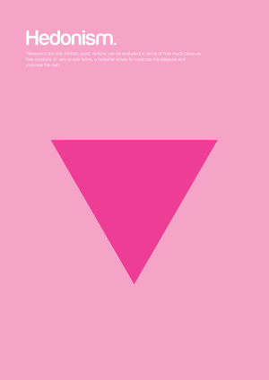

# Diseño y filosofía

Me acaba de mandar un amigo este enlace dónde [Genís Carreras](http://www.geniscarreras.com/), ha creado un diseño minimalista sobre conceptos filosóficos:

Aqui os dejo un enlace en el que podreis encontrar algunos ejemplos mas. ¿Cuál es vuestro favorito?

[Filographics](http://io9.com/5900394/minimalist-posters-explain-complex-philosophical-concepts-with-basic-shapes)
