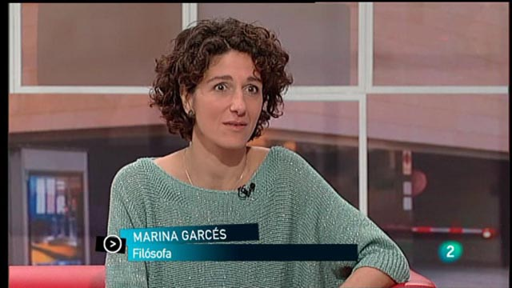

# Entrevista: Marina Garcés

[**Ver vídeo**](http://www.rtve.es/alacarta/videos/para-todos-la-2/para-todos-2-entrevista-marina-garces-catedratica-filosia/1753399/)

- [**Para Todos La 2 – Entrevista: Marina Garcés, profesora de Filosofía**](http://www.rtve.es/alacarta/videos/para-todos-la-2/para-todos-2-entrevista-marina-garces-catedratica-filosia/1753399/ "Para Todos La 2 - Entrevista:  Marina Garcés, profesora de Filosofía")
