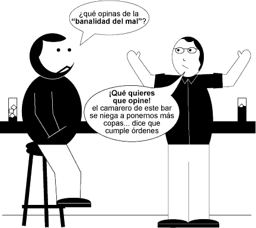

# La banalidad del mal

La banalidad del mal

La “banalidad del mal” fue una frase acuñada por Hannah Arendt, cuando tuvo que cubrir como corresponsal del The New Yorker, el juicio en Jerusalen de [Adolf Eichmann](http://es.wikipedia.org/wiki/Adolf_Eichmann "Adolf Eichmann"), un nazi al que juzgaron por crímenes contra la humanidad.
