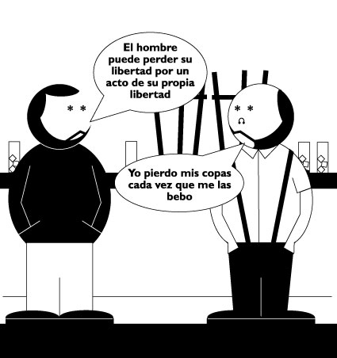

# Gurwitsch

Gurwitsch, filosofo lituano vivió amargamente la II Guerra Mundial y el auge de los totalitarismos… #Gurwitsch #filosofiadebarra para saber más: </blog/2020-03-21-el-nihilismo-en-nuestro-tiempo>
